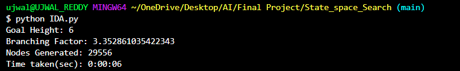

# State Space Search - Rubik's Cube Solver

This project demonstrates solving a Rubik's Cube using a state space search algorithm with Iterative Deepening A* (IDA*). The algorithm finds the optimal solution by exploring possible cube states and backtracking as necessary, while keeping track of branching factors and nodes generated.

## Algorithm

The code implements the IDA* search algorithm, using Manhattan distance as a heuristic to guide the search for the goal state. The heuristic is optimized for the cube's configuration, considering both corner and edge distances to estimate the cost to the goal.

### Output Metrics
- **Goal Height**: The depth (or number of moves) at which the solution was found.
- **Branching Factor**: The average branching factor during the search process.
- **Nodes Generated**: The total number of nodes generated to find the solution.
- **Time Taken**: The time in seconds to reach the solution.

## Example Run

### Initial State
The input cube configuration given to the algorithm:

```plaintext
              ['R' 'G' 'G']
              ['G' 'W' 'W']
              ['Y' 'Y' 'B']
['W' 'O' 'R'] ['G' 'G' 'Y'] ['O' 'B' 'R'] ['W' 'R' 'B']
['B' 'G' 'Y'] ['O' 'R' 'R'] ['B' 'B' 'W'] ['O' 'O' 'O']
['O' 'R' 'Y'] ['O' 'R' 'R'] ['B' 'B' 'W'] ['O' 'G' 'G']
              ['G' 'Y' 'Y']
              ['W' 'Y' 'Y']
              ['W' 'W' 'B']
```

### Final Solved State
The solved configuration (goal state) achieved by the algorithm:

```plaintext
              ['W' 'W' 'W']
              ['W' 'W' 'W']
              ['W' 'W' 'W']
['G' 'G' 'G'] ['R' 'R' 'R'] ['B' 'B' 'B'] ['O' 'O' 'O']
['G' 'G' 'G'] ['R' 'R' 'R'] ['B' 'B' 'B'] ['O' 'O' 'O']
['G' 'G' 'G'] ['R' 'R' 'R'] ['B' 'B' 'B'] ['O' 'O' 'O']
              ['Y' 'Y' 'Y']
              ['Y' 'Y' 'Y']
              ['Y' 'Y' 'Y']
```

### Results
The following metrics were achieved in the test run:

- **Goal Height**: 6
- **Branching Factor**: 3.35
- **Nodes Generated**: 29,556
- **Time Taken**: 6 seconds

### Screenshot

